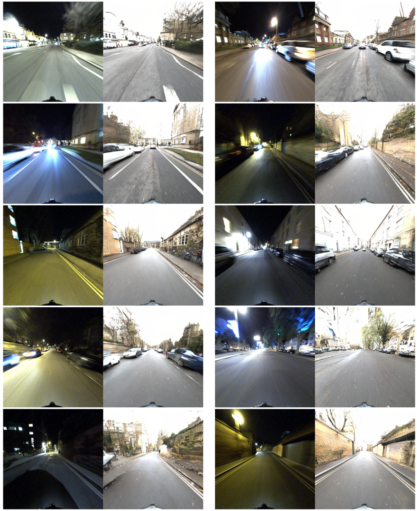

# ToDayGAN

This is our PyTorch implementation for ToDayGAN.
Code was written by [Asha Anoosheh](https://github.com/aanoosheh) (built upon [ComboGAN](https://github.com/AAnoosheh/ComboGAN))

#### [[ToDayGAN Paper]](https://arxiv.org/pdf/1809.09767.pdf)
#### [[ComboGAN Paper]](https://arxiv.org/pdf/1712.06909.pdf)


If you use this code for your research, please cite:

Night-to-Day Image Translation for Retrieval-based Localization
[Asha Anoosheh](http://ashaanoosheh.com),  [Torsten Sattler](http://people.inf.ethz.ch/sattlert/), [Radu Timofte](http://www.vision.ee.ethz.ch/~timofter/), [Marc Pollefeys](https://www.microsoft.com/en-us/research/people/mapoll/), [Luc van Gool](https://www.vision.ee.ethz.ch/en/members/get_member.cgi?id=1)
In Arxiv, 2018.


<br><br>

<br><br>



## Prerequisites
- Linux or macOS
- Python 3
- CPU or NVIDIA GPU + CUDA CuDNN

## Getting Started
### Installation
- Install PyTorch and dependencies from http://pytorch.org
- Install Torch vision from the source.
```bash
git clone https://github.com/pytorch/vision
cd vision
python setup.py install
```
- Install python libraries [visdom](https://github.com/facebookresearch/visdom) and [dominate](https://github.com/Knio/dominate).
```bash
pip install visdom
pip install dominate
```
- Clone this repo:
```bash
git clone https://github.com/AAnoosheh/ToDayGAN.git
cd ToDayGAN
```

### Training
Example running scripts can be found in the `scripts` directory.

One of our pretrained models for the Oxford Robotcars dataset is found [HERE](https://www.dropbox.com/s/mwqfbs19cptrej6/2DayGAN_Checkpoint150.zip?dl=0). Place under ./checkpoints/robotcar_2day and test using the instructions below, with args `--name robotcar_2day --dataroot ./datasets/<your_test_dir> --n_domains 2 --which_epoch 150 --loadSize 512`
Because of sesitivity to instrinsic camera characteristics, testing should ideally be on the same Oxford dataset photos (and same Grasshopper camera) found [HERE](http://robotcar-dataset.robots.ox.ac.uk/datasets).

- Train a model:
```
python train.py --name <experiment_name> --dataroot ./datasets/<your_dataset> --n_domains <N> --niter <num_epochs_constant_LR> --niter_decay <num_epochs_decaying_LR>
```
Checkpoints will be saved by default to `./checkpoints/<experiment_name>/`
- Fine-tuning/Resume training:
```
python train.py --continue_train --which_epoch <checkpoint_number_to_load> --name <experiment_name> --dataroot ./datasets/<your_dataset> --n_domains <N> --niter <num_epochs_constant_LR> --niter_decay <num_epochs_decaying_LR>
```
- Test the model:
```
python test.py --phase test --serial_test --name <experiment_name> --dataroot ./datasets/<your_dataset> --n_domains <N> --which_epoch <checkpoint_number_to_load>
```
The test results will be saved to a html file here: `./results/<experiment_name>/<epoch_number>/index.html`.


## Training/Testing Details
- Flags: see `options/train_options.py` for training-specific flags; see `options/test_options.py` for test-specific flags; and see `options/base_options.py` for all common flags.
- Dataset format: The desired data directory (provided by `--dataroot`) should contain subfolders of the form `train*/` and `test*/`, and they are loaded in alphabetical order. (Note that a folder named train10 would be loaded before train2, and thus all checkpoints and results would be ordered accordingly.)
- CPU/GPU (default `--gpu_ids 0`): set`--gpu_ids -1` to use CPU mode; set `--gpu_ids 0,1,2` for multi-GPU mode.
- Visualization: during training, the current results and loss plots can be viewed using two methods. First, if you set `--display_id` > 0, the results and loss plot will appear on a local graphics web server launched by [visdom](https://github.com/facebookresearch/visdom). To do this, you should have `visdom` installed and a server running by the command `python -m visdom.server`. The default server URL is `http://localhost:8097`. `display_id` corresponds to the window ID that is displayed on the `visdom` server. The `visdom` display functionality is turned on by default. To avoid the extra overhead of communicating with `visdom` set `--display_id 0`. Secondly, the intermediate results are also saved to `./checkpoints/<experiment_name>/web/index.html`. To avoid this, set the `--no_html` flag.
- Preprocessing: images can be resized and cropped in different ways using `--resize_or_crop` option. The default option `'resize_and_crop'` resizes the image such that the largest side becomes `opt.loadSize` and then does a random crop of size `(opt.fineSize, opt.fineSize)`. Other options are either just `resize` or `crop` on their own.

